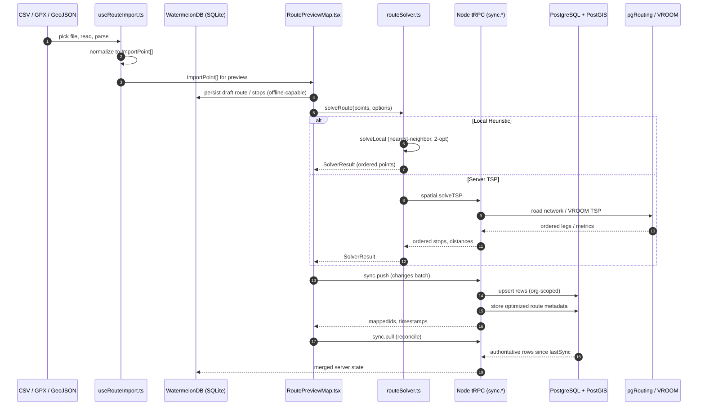

# RouteMaster Pro (Route OS)

**RouteMaster Pro** — also known as **Route OS** and branded as **[rmp.ca](https://rmp.ca)** — is an enterprise-grade, cross-platform system for **high-performance collection route optimization** with an **offline-first** data architecture. Field crews can import stops, preview and solve routes, sync with a central spatial database, and run navigation-style workflows without losing work when connectivity drops.

The mobile and web client is built on **React Native (Expo)** with **TypeScript**. The API layer is **Node.js** with **tRPC** for type-safe RPC. Authoritative spatial data and enterprise sync run against **PostgreSQL + PostGIS** (often referenced operationally as **db01**). Local persistence on device uses **WatermelonDB**; heavy routing may use **pgRouting** and **VROOM** alongside a **Python** optimizer service for advanced partitioning and VRP.

---

## Table of Contents

- [Architecture Overview](#architecture-overview)
- [Coordinate Lifecycle](#coordinate-lifecycle)
- [Five-Step Route Planning Lifecycle](#five-step-route-planning-lifecycle)
- [Technical Differentiators](#technical-differentiators)
- [API Surface](#api-surface)
- [Getting Started](#getting-started)
- [Testing Strategy](#testing-strategy)
- [Repository Layout](#repository-layout)
- [Additional Documentation](#additional-documentation)
- [License](#license)

---

## Architecture Overview

| Concern | Implementation |
|--------|----------------|
| **Edge (device)** | SQLite via WatermelonDB, optimistic UI, queue of mutations for later replay |
| **Transport** | tRPC over HTTPS to `/api/trpc` (batched RPC, type-safe contract shared with the app) |
| **Authority** | PostgreSQL + PostGIS: geography types, `ST_DWithin`, cluster/progress analytics, sync tables (`waste_points`, `routes`, `route_stops`, `zones`, `favorites`, …) |
| **Routing math** | In-process heuristics (e.g. \(O(n^2)\) nearest-neighbor on device), optional **pgRouting** / **VROOM** on the server when configured |
| **Offline ↔ online** | `sync.push` / `sync.pull` reconcile client IDs with server IDs; conflict resolution via `sync.resolveConflict` |

Higher-level flow: **the app treats the local database as primary for UX**, then **converges with PostGIS** when the network and auth session allow. Spatial queries and verification checks execute where the data is authoritative (server) or replicated (device) depending on the operation.

## Coordinate Lifecycle

The following sequence diagram illustrates the complete data flow from file import through PostGIS persistence and optional road-network optimization:



---

## Five-Step Route Planning Lifecycle

### 1. Import — Multi-Format Ingestion

**Primary Hook:** [`hooks/useRouteImport.ts`](hooks/useRouteImport.ts)

The import stage drives file pick → read → parse using **`expo-document-picker`** and **`expo-file-system`**. Supported formats align with field reality:

| Format | Parser | Notes |
|--------|--------|-------|
| **CSV** | `parseRouteCSV()` | Flexible headers (`lat`/`latitude`, `lon`/`lng`/`longitude`, names, time windows, demand, service times) |
| **GPX** | `parseGPXForNavigation()` | Routed through GPX navigation parsing with track/segment support |
| **GeoJSON** | `parseGeoJSON()`, `importGeoJSONRoute()` | Feature collections / route geometry via GeoJSON import helpers |
| **JSON** | `parseRouteJSON()` | CVRP format (`{ type: "CVRP", capacity, depot_id, nodes }`) or simple array format |

Output is normalized **`ImportPoint[]`** with optional depot, warnings, and progress state for UI:

```typescript
interface ImportResult {
  points: ImportPoint[];
  fileName: string;
  fileType: 'csv' | 'geojson' | 'gpx' | 'json';
  totalPoints: number;
  warnings: string[];
  depot?: ImportPoint;
}
```

---

### 2. Preview — Map Visualization

**Primary Component:** [`components/RoutePreviewMap.tsx`](components/RoutePreviewMap.tsx)

The Preview step renders draft pins, optional solve controls, and platform-specific maps:

- **Native:** `react-native-maps` with Mapbox / Google Maps providers
- **Web:** Fallback implementations for cross-platform consistency

Key features:
- Color-coded pins: **Orange** for draft waypoints, **Green** for depot
- Interactive reordering and editing before solve
- Route line preview after optimization (**Blue** for standard, **Purple** for optimized)
- Region fitting and initial viewport configuration

```typescript
interface RoutePreviewMapProps {
  points: RoutePreviewPoint[];
  depot?: RoutePreviewPoint;
  onPointsChange?: (points: RoutePreviewPoint[]) => void;
  onSolve?: (result: SolverResult) => void;
  onSave?: (points: RoutePreviewPoint[], result?: SolverResult) => Promise<void>;
  showSolveButton?: boolean;
  showSaveButton?: boolean;
}
```

---

### 3. Solve — Hybrid Strategy

**Primary Module:** [`lib/routeSolver.ts`](lib/routeSolver.ts)  
**Server Endpoint:** `spatial.solveTSP` in [`server/spatialRouter.ts`](server/spatialRouter.ts)

> This stage sequences **discrete stops** (TSP/VRP). For full street-coverage routing (Chinese Postman), see [Route Optimizer v2](#chinese-postman--street-coverage-optimizer-route-optimizer-v2) in Technical Differentiators.

The solve stage implements **local** heuristics for fast, offline-capable sequencing, with optional **server-side** road-network optimization:

#### Local Solvers (`solveLocal`)

| Algorithm | Complexity | Use Case |
|-----------|------------|----------|
| **nearest-neighbor** | \(O(n^2)\) | Fast initial solution, offline-first |
| **2-opt** | \(O(n^2)\) per iteration | Nearest-neighbor seed → 2-opt improvement → Or-opt cleanup pass |

> **Note:** Or-opt (single-node relocation) runs automatically after 2-opt as a cleanup pass. It is not a selectable algorithm on its own.

#### Server Solvers (`solveServer`)

| Algorithm | Backend | Use Case |
|-----------|---------|----------|
| **pgrouting** | PostGIS/pgRouting | Road-network TSP with turn costs |
| **vroom** | VROOM HTTP service | Fleet VRP, capacity constraints, time windows |
| **nearest-neighbor / 2-opt** | Server-side fallback | Consistent with local when road network unavailable |

```typescript
// Local-first with server fallback
export async function solveRoute(
  points: SolverPoint[],
  options: SolverOptions = { algorithm: "2-opt" },
): Promise<SolverResult> {
  if (options.algorithm === "pgrouting" || options.algorithm === "vroom") {
    return solveServer(points, options);
  }
  return solveLocal(points, options);
}
```

---

### 4. Sync — tRPC Persistence and WatermelonDB

**Primary Router:** [`server/syncRouter.ts`](server/syncRouter.ts)  
**Persistence Bridge:** [`lib/routePersistence.ts`](lib/routePersistence.ts)

The sync stage handles **bidirectional synchronization** between mobile SQLite (WatermelonDB) and PostgreSQL:

| Operation | Direction | Purpose |
|-----------|-----------|---------|
| `sync.push` | Client → Server | Batch local creates/updates/deletes → PostgreSQL; returns `mappedIds` |
| `sync.pull` | Server → Client | Incremental server changes for given tables since `lastSync` |
| `sync.resolveConflict` | Manual | `keep_local` / `keep_server` / `merge` strategies |

All operations assume a signed-in user with an **organization** (`orgId`); the server writes through **Drizzle ORM** to PostgreSQL (see [`server/db.ts`](server/db.ts)).

```typescript
// Sync change schema
const SyncChangeSchema = z.object({
  id: z.string(),           // Local WatermelonDB ID
  table: z.string(),        // Table name
  action: z.enum(["create", "update", "delete"]),
  data: z.record(z.string(), z.unknown()),
  timestamp: z.number().optional(),
});
```

---

### 5. Navigate — Polylines, Progress, and Sequence

**Primary Router:** `navigation` tRPC router

After sync, the run phase emphasizes:

- **Ordered geometry** — Polylines and segments from the solver
- **Stop status** — `pending` → `completed` / `skipped` / `issue`
- **Spatial progress** — `spatial.getRouteProgress` for remaining stops and distance
- **Turn-by-turn UX** — Navigation-style interface building on the shared route model

---

## Technical Differentiators

### Verified Scan (QR + PostGIS Geofence)

**Endpoint:** `spatial.verifyAndCollect` in [`server/spatialRouter.ts`](server/spatialRouter.ts)

This feature binds **digital proof** to **physical proximity**:

```typescript
// 1. Find bin by QR token
// 2. Verify driver is within 10 meters using ST_DWithin
const bin = await db.execute(sql`
  SELECT id 
  FROM ${collectionPoints}
  WHERE qr_code_token = ${input.qrToken}
  AND ST_DWithin(
    location, 
    ST_MakePoint(${input.driverLng}, ${input.driverLat})::geography, 
    10  -- 10 meter geofence
  )
`);

// 3. Mark as collected only if geofence check passes
if (bin.length > 0) {
  await db.update(collectionPoints)
    .set({ isCollected: true })
    .where(eq(collectionPoints.id, bin[0].id));
}
```

This ensures that a driver cannot mark a bin as collected unless they are physically present at the location, verified by PostGIS geography calculations.

---

### Antimeridian Handling (±180°)

**Test Fixture:** [`shared/test-fixtures/spatial/antimeridian_wrap.geojson`](shared/test-fixtures/spatial/antimeridian_wrap.geojson)

Routes that cross the **International Date Line** (±180° longitude) require special handling:

```json
{
  "type": "Feature",
  "id": "am-1",
  "properties": { "name": "West of antimeridian" },
  "geometry": {
    "type": "Point",
    "coordinates": [179.9, 10.0]  // Just west of ±180°
  }
},
{
  "type": "Feature",
  "id": "am-2",
  "properties": { "name": "East of antimeridian" },
  "geometry": {
    "type": "Point",
    "coordinates": [-179.9, 10.0]  // Just east of ±180°
  }
}
```

The solver and distance calculations must correctly handle the wrap-around distance (approximately 22 km at latitude 10°) rather than the naive 359.8° difference. This is critical for:
- Pacific island routes (Fiji, Kiribati, Russia's easternmost points)
- Global logistics spanning the Pacific
- Accurate ETAs and fuel calculations

---

### Kotlin Multiplatform (`shared-logic`)

**Module:** [`shared-logic/`](shared-logic/README.md)

The **Kotlin Multiplatform** Gradle module contains **CVRP / CPP-style** math for **Android** and optional **Kotlin/JS** consumption from TypeScript:

| Platform | Integration |
|----------|-------------|
| **Web / Expo / Vercel** | Default `package.json` uses `file:./shared-logic/pnpm-stub` (empty stub) so `pnpm install` works without Gradle. Enable the bridge by building JS and linking. |
| **Android** | Add as Gradle dependency: `implementation(project(":shared-logic"))` |
| **iOS** | Add `iosArm64()` / `iosSimulatorArm64()` targets and XCFramework output |

```bash
# Build the real thing (requires JDK 17)
./gradlew :shared-logic:assemble
# or
pnpm run build:shared-logic
```

---

### Optimization Strategy Comparison

The codebase contains three distinct route optimization paths that solve fundamentally different problems:

| | Route Optimizer v2 (`lib/route-optimizer-v2`) | TSP Solver (`lib/routeSolver.ts`) | Python Backend (`backend/` + `optimizer` router) |
|---|---|---|---|
| **Problem** | Chinese Postman — cover every street at least once | TSP/VRP — visit a set of discrete stops in optimal order | TSP/VRP — larger fleets, zone partitioning |
| **Input** | OSM XML or GeoJSON road network | Array of lat/lon stop coordinates | Array of stops + vehicle/capacity constraints |
| **Algorithm** | Edge doubling → Hierholzer (Eulerian circuit) | nearest-neighbor + 2-opt + Or-opt | VROOM / spectral zone partitioning |
| **Runs** | On-device, no network | On-device, no network | Server-side (Python FastAPI) |
| **Use case** | Trash collection (cover all roads in a zone) | Delivery / pickup sequencing | Large fleet dispatch |

---

### Chinese Postman / Street-Coverage Optimizer (Route Optimizer v2)

**Module:** [`lib/route-optimizer-v2/`](lib/route-optimizer-v2/)  
**Class:** `RouteOptimizer`  
**Inputs:** [`OSMParser`](lib/route-optimizer-v2/osmParser.ts) or [`GeoJSONParser`](lib/route-optimizer-v2/geojsonParser.ts)

This is the most distinctive algorithm in the codebase. Rather than sequencing discrete stops (TSP), it solves the **Chinese Postman Problem** — producing a route that traverses every serviceable street in a zone at least once. This is the correct model for trash collection, where coverage is the objective, not minimizing inter-stop distance.

#### Pipeline

```
OSM / GeoJSON
      │
      ▼
1. buildOriginalGraph()
   • Filter non-vehicle roads (footways, cycleways, steps, platforms …)
   • Split ways at intersections → one edge per run with full geometry
   • Deduplicate segments (5-decimal segmentKey, ~1.1m precision)
   • Merge nearby nodes within threshold (Union-Find, grid spatial index)
      │
      ▼
2. doubleEdges()
   • Pass 1: every original edge → "forward" copy (bidirectional already has both directions)
   • Pass 2: one-way edges → reverse copy (mode A) so both curbs are serviced
   • Pass 3: serviceBothSides option → second copy of every bidirectional edge
   • identifyDeadEnds() + applyUturnRestrictions()
   • repairBalance() — adds virtual dead-head edges between unbalanced nodes
     to guarantee an Eulerian graph for Hierholzer
      │
      ▼
3. hierholzerWithTurnOptimization()
   • Per connected component (handles disconnected sub-zones)
   • Edge selector scores each candidate:
       score = |outgoing_bearing − 90°|    ← prefers right turns
             + U-turn penalty (1000 base + cumulative for repeated U-turns)
             + left-turn penalty (configurable, default 50)
             + recency penalty (12-node stack window)
             + cycle-detector penalty (Tarjan-inspired SCC tabu list)
             + edge traversal quota penalty (discourages re-traversal)
             + dead-end avoidance heuristic
   • Oscillation detection → local tabu node list
   • Components concatenated → single route covering the whole zone
      │
      ▼
4. buildRoutePointsFromCircuit()
   • Expands node IDs back to lat/lon using stored edge geometry
   • Road-following polyline (no straight-line jumps across curves)
```

#### Key design decisions

- **Array-based adjacency list** — parallel edges between the same node pair (divided boulevards, parallel service roads) are preserved with unique `edgeId`s, not silently collapsed.
- **U-turn restrictions** from OSM `restriction` relations and mid-block detection (degree-2 nodes on the same way) are enforced during edge selection.
- **Virtual dead-head edges** (wayId `"__virtual__"`) balance the graph when degree counts don't match — they appear in the route but are excluded from turn stats and distance totals.
- **Multi-component support** — Hierholzer runs independently on each weakly connected component so isolated sub-zones (e.g. a cul-de-sac cluster) are never silently skipped.

#### Configuration (`RouteOptimizerOptions`)

| Option | Default | Effect |
|--------|---------|--------|
| `mergeNearbyThresholdM` | `2` | Merge nodes within N metres (use ~15 for offset divided roads) |
| `antiLoopMode` | `"standard"` | `"off"` / `"standard"` / `"strict"` — cycle detection aggressiveness |
| `serviceBothSides` | `false` | Traverse each bidirectional street twice (left + right curb) |
| `minEdgeMeters` | `0.05` | Drop micro-stub edges below this length |

#### Output (`OptimizationResult`)

```typescript
{
  route: RoutePoint[];          // Ordered lat/lon polyline
  totalDistance: number;        // km
  message: string;              // Human-readable summary
  stats: {
    right_turns, left_turns, u_turns, straight,
    efficiency,                 // % of original edges covered once
    dead_ends_identified,
    oneway_violations,          // Segments driven against traffic (mode A)
    single_pass_segments,       // One-way segments driven once only (mode B)
  }
}
```

---

### AI-Assisted Route Analysis (Vercel AI Gateway)

**Router:** [`server/aiRouteAnalysisRouter.ts`](server/aiRouteAnalysisRouter.ts)

Combines **PostGIS-backed logistics reports** with **`chatWithAiGateway`** (see [`server/aiProxy.ts`](server/aiProxy.ts)) to produce **actionable narrative analysis**:

- Efficiency scoring and hotspots
- Backtracking risk assessment
- Baseline comparisons (`compareEfficiency`)
- Natural language explanations of route performance

---

### Natural Language Constraint Parsing (Firebase Gemini)

**Module:** [`lib/firebase/ai.ts`](lib/firebase/ai.ts)

Dispatchers type instructions in plain English; **Gemini 2.0 Flash** parses them into structured routing rules the optimization engine can consume directly.

- Supports 13 constraint types: `skip`, `avoid`, `time_window`, `direction`, `priority`, `delay`, `frequency`, `vehicle`, `crew`, `seasonal`, `temporary`, `permanent`, `special_instruction`
- Returns structured JSON with confidence scores and ambiguity flags
- Native dev builds use `@react-native-firebase/ai`; web/Expo Go use the Firebase JS SDK
- Shared factory `createLazyGeminiModel` makes it easy to add new Gemini-backed features

---

### Weather-Aware Route Recommendations (Gemini, Cross-Platform)

**Module:** [`services/leapAIService.ts`](services/leapAIService.ts)  
**Analysis:** [`services/weatherAnalysis.ts`](services/weatherAnalysis.ts)

When the `weatherOptimizedRouting` beta flag is on, **Gemini 2.0 Flash** analyses real-time weather against the planned route and returns driver-facing recommendations (delay start, reorder stops, segment warnings). Works on iOS, Android, and web via the same Firebase AI setup as constraint parsing.

Rule-based scoring (precipitation, visibility, wind) always runs first and serves as a fallback if the AI call fails.

---

### AI Co-Pilot (Genkit + Gemini 2.5 Flash)

**Module:** [`server/genkit/coPilot.ts`](server/genkit/coPilot.ts)  
**Router:** [`server/voiceRouter.ts`](server/voiceRouter.ts) (`voice.chat`)

A route-aware voice companion powered by **Gemini 2.5 Flash** via Firebase Genkit. Receives the driver's live navigation state (current street, next maneuver, ETA, weather summary) as context and returns short TTS-friendly responses (≤256 tokens).

- Moonshine on-device STT (native) → Whisper API fallback (all platforms) for transcription
- Optional RAG context for domain-specific knowledge
- Supports OpenRouter as an AI gateway alternative

---

## API Surface

All tRPC procedures are invoked over **`POST /api/trpc`** (and related batch/link conventions per `@trpc/client`). Dot notation below is the **router path** (e.g. `sync.push`).

### `sync` — Offline-First WatermelonDB / Org Data

| Procedure | Type | Purpose |
|-----------|------|---------|
| `sync.push` | mutation | Batch local creates/updates/deletes → PostgreSQL; returns `mappedIds` |
| `sync.pull` | query | Incremental server changes for given tables |
| `sync.nearbyWastePoints` | query | Radius-based fetch for sync windows |
| `sync.status` | query | Pending counts and last sync per table |
| `sync.resolveConflict` | mutation | `keep_local` / `keep_server` / `merge` |
| `sync.createRoute` | mutation | Create route row (org-scoped) |
| `sync.updateRoute` | mutation | Update route metadata |
| `sync.deleteRoute` | mutation | Delete route (and related stops) |
| `sync.getRoute` | query | Fetch route by id |
| `sync.getRouteStops` | query | Stops for a route |
| `sync.createRouteStop` | mutation | Insert stop with sequence |
| `sync.updateRouteStop` | mutation | Status, completion time, notes, photo URI |

### `spatial` — PostGIS Operations and TSP

| Procedure | Type | Purpose |
|-----------|------|---------|
| `spatial.getNearbyPoints` | query | Bins / points near lng/lat (+ radius) |
| `spatial.verifyAndCollect` | mutation | **QR + 10 m geofence verification** |
| `spatial.solveTSP` | mutation | **pgrouting** / **vroom** / local-style algorithms |
| `spatial.getRouteProgress` | query | Remaining stops / distance aggregate |
| `spatial.toggleCollectionStatus` | mutation | Flip collected flag |
| `spatial.resetAllBins` | mutation | Shift reset helper |
| `spatial.analyzeRoutePerformance` | mutation | Post-route analytics hook |

### `aiRouteAnalysis` — PostGIS + LLM

| Procedure | Type | Purpose |
|-----------|------|---------|
| `aiRouteAnalysis.getLogisticsReport` | query | Raw spatial logistics report |
| `aiRouteAnalysis.analyzeRoute` | mutation | Report + Vercel AI Gateway narrative (auth) |
| `aiRouteAnalysis.getEfficiencyScore` | query | Lightweight efficiency widget |
| `aiRouteAnalysis.getHotspots` | query | Density hotspots |
| `aiRouteAnalysis.compareEfficiency` | mutation | Baseline comparison (auth) |

### `org` — Organization Management (admin only)

| Procedure | Type | Purpose |
|-----------|------|---------|
| `org.create` | mutation | Create organization record |
| `org.list` | query | List all organizations |
| `org.get` | query | Get single organization by id |
| `org.listUsers` | query | List all users belonging to an organization |
| `org.assignUser` | mutation | Assign / remove user from an organization |

### `navigation` — Turn-by-Turn Instructions

| Procedure | Type | Purpose |
|-----------|------|---------|
| `navigation.generateInstructions` | mutation | Turn-by-turn instructions from Hierholzer route output |
| `navigation.buildMatchedRoute` | mutation | Full `MatchedRoute` (steps, geometry, instructions) for `NavigationEngine` |

### `voice` — AI Co-Pilot

| Procedure | Type | Purpose |
|-----------|------|---------|
| `voice.transcribe` | mutation | Speech-to-text (Moonshine sidecar → Whisper fallback) |
| `voice.chat` | mutation | Genkit co-pilot: text in, TTS-ready reply out |

### `costHistory` — Route Cost Training Data (MongoDB)

| Procedure | Type | Purpose |
|-----------|------|---------|
| `costHistory.store` | mutation | Store actual vs predicted cost entry |
| `costHistory.getTrainingData` | query | Retrieve entries for ML model training |
| `costHistory.getAccuracyStats` | query | Prediction accuracy aggregated by day/week/vehicle/weather |
| `costHistory.getCostFactorAnalysis` | query | Per-factor breakdown (weather, experience, time of day, season) |
| `costHistory.exportCostTrainingData` | mutation | ML-ready export with encoded features and correction factor targets |

### `gpxTraining` — GPX File Access

| Procedure | Type | Purpose |
|-----------|------|---------|
| `gpxTraining.list` | query | List `.gpx` files from configured training folder (org-scoped) |
| `gpxTraining.getContent` | query | Read GPX XML by filename (path-traversal safe) |

### `logisticsZones` — Zone + Waste Point Spatial Queries

| Procedure | Type | Purpose |
|-----------|------|---------|
| `logisticsZones.listZones` | query | Active zones for the user's org |
| `logisticsZones.listWastePointsInZone` | query | Points inside a zone polygon (`ST_Contains`) |

### `optimizer` — Python FastAPI Proxy

| Procedure | Type | Purpose |
|-----------|------|---------|
| `optimizer.optimize` | mutation | CPP / VRP optimization via Python backend |
| `optimizer.partition` | mutation | Spectral zone partitioning |
| `optimizer.partitionFromGeoJSON` | mutation | Partition from GeoJSON input |
| `optimizer.partitionFromPoints` | mutation | Partition from coordinate list |
| `optimizer.health` | query | Python backend liveness check |

### REST Adjuncts (Same Node Process)

Not exhaustive — see [`server/_core/index.ts`](server/_core/index.ts) for the canonical list:

| Method | Path | Role |
|--------|------|------|
| GET | `/api/health` | Liveness |
| GET | `/api/config` | Maps keys, OSRM proxy hints |
| POST | `/api/optimize` | Python optimizer proxy |
| POST | `/api/vroom/optimize` | VROOM proxy |
| POST | `/api/trpc` | tRPC batch |

---

## Getting Started

### Prerequisites

| Requirement | Version | Notes |
|-------------|---------|-------|
| **Node.js** | 18+ | LTS recommended |
| **pnpm** | 10 | `packageManager` in [`package.json`](package.json) |
| **PostgreSQL** | 17+ | With **PostGIS** 3.4+ extension |
| **pgRouting** | (optional) | For road-network TSP |
| **JDK** | 17 | Only if building **`shared-logic`** |
| **Python** | 3.x | For [`backend/`](backend/) FastAPI optimizer |

### Install and Run (Development)

```bash
# Clone the repository
git clone <repo-url> rmp.ca
cd rmp.ca

# Install dependencies
pnpm install

# Configure environment
cp .env.example .env

# Set DATABASE_URL=postgres://... pointing at your PostGIS instance (e.g. db01)
# Set EXPO_PUBLIC_API_BASE_URL (default http://localhost:3000 for local API)

# Start development server (Express + tRPC)
pnpm dev:server

# In another terminal, start Expo web
pnpm dev

# Or run both together
pnpm dev:all
```

For **mobile on a physical device**, set `EXPO_PUBLIC_API_BASE_URL` to your dev machine **LAN IP** (not `localhost`) and see comments in `.env.example` for `REACT_NATIVE_PACKAGER_HOSTNAME`.

### Database on FreeBSD (`db01`) and Networking

Many teams host **PostgreSQL/PostGIS** on a **FreeBSD** VM or bare-metal box (`db01`). Typical pattern:

1. Expose Postgres only on a **private** VLAN/VPN or SSH tunnel
2. Set **`DATABASE_URL`** on the Node server to that instance (SSL mode as appropriate)
3. Run **`pnpm db:push`** (Drizzle migrations) when schema changes land

#### Networking & Troubleshooting (NordVPN + FreeBSD `db01`)

If you are developing on Ubuntu/Kali and syncing against a FreeBSD (`db01`) PostGIS instance, you may hit `ETIMEDOUT` or `ECONNREFUSED` during `pnpm db:push` or tRPC calls.

1. **NordVPN and local discovery**
   - NordVPN Meshnet/Kill Switch can intercept traffic to your local bridge (`192.168.x.x`, `10.0.x.x`).
   - Whitelist local DB access in NordVPN CLI:

     ```bash
     nordvpn whitelist add port 5432
     nordvpn whitelist add subnet 192.168.1.0/24
     ```

   - If `db01` is a local hostname, NordVPN DNS can fail to resolve it. Prefer a static IP in `DATABASE_URL` when troubleshooting.

2. **FreeBSD VM (`db01`) connectivity checklist**
   - In `postgresql.conf`, set `listen_addresses = '*'` (or a specific host-reachable IP).
   - In `pg_hba.conf`, allow your dev subnet:

     ```conf
     host    all             all             192.168.1.0/24          md5
     ```

   - Ensure FreeBSD `pf` rules permit inbound `5432` from your dev subnet.
   - For device-to-DB development on the same Wi-Fi, use a **Bridged Adapter** instead of NAT in your VM manager.

3. **The "10-meter test" (GPS mocking)**
   - If Verified Scan/PostGIS geofence checks fail, confirm your device location is fresh (not stale).
   - Use an Android GPS mocking app and set coordinates within 10 meters of the `waste_point` under test.
   - Check `spatial.verifyAndCollect` server logs for the computed `ST_Distance`.

Document the team-standard networking rule (VPN mode + subnet policy + hostname/IP conventions) so the local-first sync path is stable for all developers.

### Optional Services

| Service | Configuration | Purpose |
|---------|---------------|---------|
| **VROOM** | `VROOM_URL` (default `http://localhost:3100`) | Road-network VRP solver |
| **Overture Extract** | `EXPO_PUBLIC_OVERTURE_EXTRACT_URL` | Large-scale map data |
| **Optimizer Backend** | `OPTIMIZER_BACKEND_URL` | Python FastAPI spectral zoning / advanced VRP |

See [`.env.example`](.env.example) and [docs/DOCKER.md](docs/DOCKER.md) for composed stacks.

---

## Testing strategy

| Scope | Command / location |
|--------|--------------------|
| Unit / integration | `pnpm test` (Vitest) |
| Typecheck | `pnpm check` |
| Spatial scripts | `pnpm test:spatial` |
| Server integration | `pnpm test:integration` (sets `TEST_API_BASE_URL`) |
| Shared fixtures | [`shared/test-fixtures/`](shared/test-fixtures/) |

**Solver and parser fixtures**

- [`shared/test-fixtures/algorithms/tsp_z_shape.json`](shared/test-fixtures/algorithms/tsp_z_shape.json) — non-trivial TSP geometry for heuristic regression.
- [`shared/test-fixtures/perf/load_200_points.json`](shared/test-fixtures/perf/load_200_points.json) — scale smoke for performance-sensitive paths.
- [`shared/test-fixtures/parsers/malformed_headers.csv`](shared/test-fixtures/parsers/malformed_headers.csv) — CSV edge cases.
- [`shared/test-fixtures/spatial/antimeridian_wrap.geojson`](shared/test-fixtures/spatial/antimeridian_wrap.geojson) — **±180° / antimeridian** wrap around logic for spatial imports and distance handling.

Use these fixtures in Vitest or SQL harnesses (see [`TESTS/database/postgis-spatial.test.sql`](TESTS/database/postgis-spatial.test.sql) where present) to guard **world-spanning** routes.

---

## Repository layout (abbreviated)

| Path | Role |
|------|------|
| `app/` | Expo Router screens |
| `server/` | Express, tRPC routers, PostGIS services |
| `backend/` | Python FastAPI optimizer |
| `lib/` | `routeSolver`, `routePersistence`, database + tRPC client |
| `hooks/` | `useRouteImport` and app hooks |
| `components/` | `RoutePreviewMap`, map UI |
| `drizzle/` | Schema and migrations (PostgreSQL target) |
| `shared-logic/` | Kotlin Multiplatform math |
| `shared/test-fixtures/` | Cross-package test payloads |

---

## Additional documentation

- [docs/PLUGIN_ARCHITECTURE_CUSTOM_SOLVERS.md](docs/PLUGIN_ARCHITECTURE_CUSTOM_SOLVERS.md) — plugin system and custom solver API
- [docs/CUSTOM_SOLVERS.md](docs/CUSTOM_SOLVERS.md) — custom solver integration guide
- [docs/README_GPX_ANDROID.md](docs/README_GPX_ANDROID.md) — GPX on Android
- [docs/OFFLINE_FIRST_PLAN.md](docs/OFFLINE_FIRST_PLAN.md) — offline-first architecture decisions
- [docs/CLI.md](docs/CLI.md) — CLI tooling reference
- [docs/DEM_SETUP.md](docs/DEM_SETUP.md) — elevation data setup

---

## License

**Proprietary.** All rights reserved. No use, copy, modification, or distribution without prior approval from the copyright holder.
