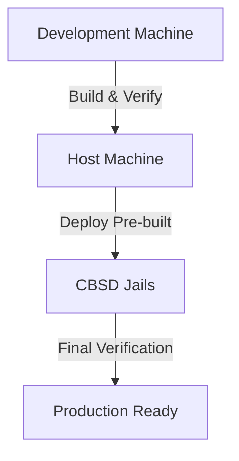

# Pre-built Deployment Workflow for CBSD Jails

This document describes the recommended **Build → Verify → Deploy** workflow for RouteMasterPro in CBSD jail environments.

## Why Pre-built Deployment?

The pre-built approach provides three major advantages:

1. **Atomic Deploys**: Ensures verified code matches running code exactly
2. **Bypass Network Issues**: Solves CBSD's network isolation constraints
3. **Reproducibility**: Exact build artifacts can be verified locally before deployment

## Workflow Overview



## Step-by-Step Implementation

### 1. Build Phase (Host/Development Machine)

```bash
# Navigate to project root
cd /home/drone/Documents/rmp.ca

# Build extract service
cd extract
npm install --omit=dev
cd ..

# Build backend service  
npm install -g pnpm@10.0.0
pnpm install --no-frozen-lockfile --ignore-scripts
pnpm rebuild esbuild
pnpm run build:server
pnpm install --no-frozen-lockfile --prod --ignore-scripts

# Build optimizer service (if needed)
cd optimizer
python -m venv venv
source venv/bin/activate
pip install -r requirements.txt
cd ..

# Build moonshine service (if needed)
cd moonshine
npm install --omit=dev
cd ..
```

### 2. Local Verification Phase

```bash
# Run Lean 4 verification on local build
cd .vibe/skills/lean-verify
sh verify-local.sh

# Save verified artifacts for comparison
mkdir -p verified-builds/rmpca-extract
cp -r ../extract/* verified-builds/rmpca-extract/

mkdir -p verified-builds/rmpca-backend
cp -r ../* verified-builds/rmpca-backend/  # Exclude node_modules if large
```

### 3. Deploy Phase (CBSD Jails)

```bash
# Run pre-built deployment
su root -c "sh cbsd/deploy-prebuilt.sh --all"
```

This script will:
- Use `rsync` for atomic deployment to each jail
- Configure inter-service communication with correct IPs
- Start services in the correct order
- Handle CBSD's read-only filesystem constraints

### 4. Final Verification Phase

```bash
# Verify deployed artifacts match verified builds
cd .vibe/skills/lean-verify
sh verify.sh
```

The verification script will:
- Extract Lean files from each jail
- Run Lean 4 termination checking
- Compare jail contents with verified build artifacts
- Provide pass/fail status for stability marking

## Files Created

### Deployment Scripts
- `cbsd/deploy-prebuilt.sh` - Main pre-built deployment driver
- `cbsd/deploy-existing-offline.sh` - Fallback offline deployment
- `cbsd/setup-existing.sh` - Setup for existing jails

### Verification Framework
- `.vibe/skills/lean-verify/SKILL.md` - Complete verification skill
- `.vibe/skills/lean-verify/verify.sh` - Verification driver
- `.vibe/skills/lean-verify/verify-local.sh` - Local verification helper

### Documentation
- `cbsd/PREBUILT_DEPLOYMENT.md` - This document
- `cbsd/SETUP_EXISTING.md` - Existing jail setup guide

## Key Features

### Atomic Deployment
```bash
# The atomic_rsync function ensures complete or failed deployment
atomic_rsync() {
    # 1. Create temp directory
    # 2. Copy to temp
    # 3. Verify temp
    # 4. Deploy to jail
    # 5. Clean up
}
```

### Artifact Comparison
```bash
# Compare jail contents with verified builds
if diff -r "${REPO_ROOT}/verified-builds/${jail}" "${verify_dir}" >/dev/null 2>&1; then
    INFO "✓ ${jail} artifact comparison passed"
else
    ERROR "✗ ${jail} artifact comparison failed"
fi
```

### Service Configuration
```bash
# Automatic IP detection and service configuration
EXTRACT_IP=$(get_jail_ip "rmpca-extract")
cat > /usr/local/etc/rmpca/backend.env <<ENV
NODE_ENV=production
PORT=3000
EXTRACT_WS_UPSTREAM=http://${EXTRACT_IP}:9000
ENV
```

## Troubleshooting

### Common Issues

**Issue: npm not available in jail**
```bash
# Solution: Use pre-built deployment or copy from host
su root -c "sh cbsd/deploy-prebuilt.sh --all"
```

**Issue: Service not starting**
```bash
# Check service logs
cbsd jexec jname=rmpca-backend service backend status
cbsd jlogs jname=rmpca-backend
```

**Issue: Verification failure**
```bash
# Check diff output
cd .vibe/skills/lean-verify
diff -r verified-builds/rmpca-extract /tmp/lean-verify-rmpca-extract
```

## Best Practices

### 1. Build Once, Deploy Many
- Build artifacts once on development machine
- Deploy same artifacts to multiple environments
- Ensures consistency across staging/production

### 2. Verify Before and After
- Local verification before deployment
- Jail verification after deployment
- Compare artifacts at each stage

### 3. Atomic Rollback
```bash
# Keep previous version for rollback
mkdir -p previous-deploys/$(date +%Y%m%d-%H%M%S)
cp -r current-deploy/* previous-deploys/$(date +%Y%m%d-%H%M%S)/
```

### 4. Minimal Jail Changes
- Avoid installing build tools in jails
- Keep jails focused on runtime
- Build dependencies stay on host

## Integration with CI/CD

```yaml
# Example GitHub Actions workflow
name: Build and Verify

on: [push]

jobs:
  build:
    runs-on: ubuntu-latest
    steps:
    - uses: actions/checkout@v4
    - name: Setup Node.js
      uses: actions/setup-node@v4
      with:
        node-version: 20
    - name: Install dependencies
      run: npm install
    - name: Build
      run: npm run build
    - name: Local verification
      run: .vibe/skills/lean-verify/verify-local.sh
    - name: Save artifacts
      uses: actions/upload-artifact@v3
      with:
        name: verified-build
        path: ./
```

## Security Considerations

### 1. Artifact Integrity
- Use checksums for verified builds
- Sign artifacts with GPG
- Verify signatures before deployment

### 2. Jail Isolation
- CBSD's network isolation is a feature, not a bug
- Keep build tools out of production jails
- Use separate build jails if needed

### 3. Secret Management
- Never include secrets in verified artifacts
- Use environment variables or secret mounts
- Inject secrets at runtime

## Performance Optimization

### 1. Incremental Builds
```bash
# Only rebuild changed components
if [ -d "node_modules" ]; then
    echo "Dependencies already installed"
else
    npm install --omit=dev
fi
```

### 2. Parallel Deployment
```bash
# Deploy to multiple jails in parallel
for jail in rmpca-extract rmpca-backend; do
    (deploy_to_jail "${jail}" &)
done
wait
```

### 3. Caching
```bash
# Cache node_modules between builds
mkdir -p ~/.npm-cache
npm install --cache ~/.npm-cache --omit=dev
```

## Future Enhancements

### 1. Automated Rollback
- Detect verification failures
- Automatically rollback to previous version
- Notify operators

### 2. Canary Deployments
- Deploy to subset of jails first
- Verify in production-like environment
- Gradual rollout

### 3. Blue-Green Deployment
- Maintain two identical environments
- Switch traffic between them
- Zero-downtime updates

### 4. Integration Testing
- Add post-deployment integration tests
- Verify inter-service communication
- Test failure scenarios

## Conclusion

The pre-built deployment workflow provides a robust, verifiable approach to deploying RouteMasterPro in CBSD jail environments. By separating build, verification, and deployment phases, you gain:

- **Reliability**: Verified artifacts ensure consistency
- **Security**: Network isolation maintained
- **Reproducibility**: Exact builds can be redeployed
- **Verifiability**: Lean 4 proofs ensure correctness

This approach aligns perfectly with formal verification requirements and CBSD's security constraints.
